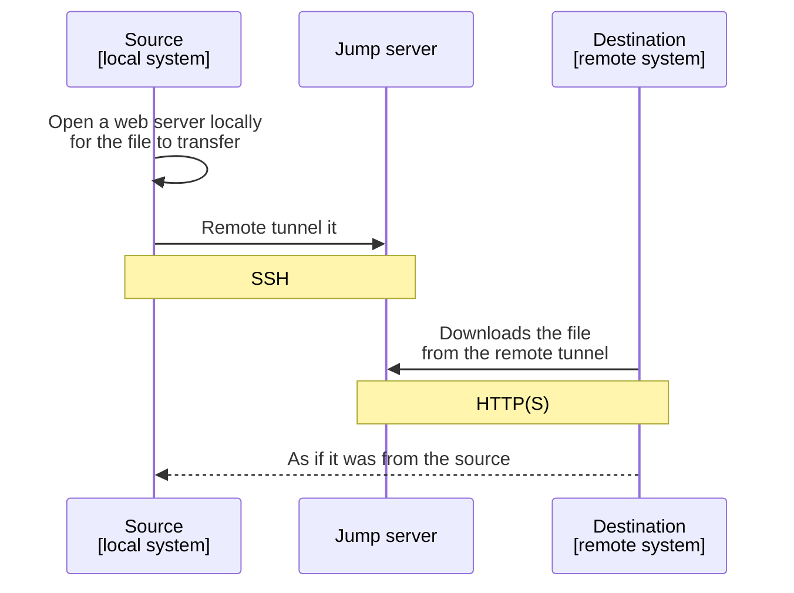

# fileserver v0.1.3

**The problem**: You need to copy a file to a remote system to which you only have shell access.

**The BOM**: You have a "jump server" wich you can access via SSH from local, and a port on it accessible from the remote system. Nothing else is used on it, only SSH.

**The solution**: You run a script on the local system. The script outputs a `curl` command. You use this `curl` on the remote system to get the file. Or you can use a browser.

**The plus**: The connection is always secure and the file is only stored on the local and remote systems.

---

This project aids in setting up a tunnel that serves a single file on an encrypted connection, allowing to source it from your system and download it on another system you don't have "direct" access to, because under a firewall or such reasons.

It employs a "jump server" to which it will reverse tunnel - via SSH - a local web server it creates. In principle, this jump server can be something you already have, all that is needed is SSH access to it.

It has been tested under Linux, both for the source and destination system; it will be adapted to Windows and MacOS.

## Prerequisites

- A "jump server" that you can access via SSH from the source system;
  - A free port on it, accessible by "the world";
  - SSH on the jump server must be configured to allow remote tunnels (see below);
- `python` v3 on the source system;
- `curl` (or a browser) on the destination system.

## Usage

- First, configure the script `filetunnel.sh` with some parameters;
- Run it with the file to transfer:
```bash
./fileserver.sh myFile.binary
```
- It will output a `curl` command to use on the destination system to download the file;
  - You can also use a browser, dealing with the self-signed certificate warning.

## Setup

You need to ensure that the jump server is set up correctly, then configure the script.
After this, you can simply use it forever and ever ;-).

### The jump server

This is a "normal" server such as a VPS, that you can access via SSH from the source system.

A port must be mapped/accessible from "outside", at least from the destination system.

On ssh, (reverse) tunneling must be enabled. Ensure that you have this setting in `/etc/ssh/sshd_config`:

```python
AllowTcpForwarding yes
```

We'll also need to access the remote-forwarded port from outside. So, set:

```python
GatewayPorts clientspecified # or 'yes'
```

**WARNING!** This setting allows the forwarded port (*any* forwarded port, even for other uses) to be globally accessible. Consider the security implications of this.

### Script (for the source system)

Download `filetunnel.sh` from the [release page](https://github.com/proofrock/filetunnel/releases).

Open it, and configure the variables in the first section. You'll need:

- `SSH_SERVER`: address to contact the jump server from the source system, using ssh, in form `user@host`.
- `FILE_SERVER`: IP or DNS name to contact the jump server from the destination system.
- `PORT`: port on the jump server for the tunnel, accessible from the destination server.

If you want HTTPS, see the next section.

### Setup https

First, generate the certificates using:
```bash
openssl req -newkey rsa:4096 -nodes -keyout key.pem -x509 -days 365 -out cert.pem
```
This will generate a `cert.pem` and a (secret) `key.pem` files.

Then configure `fileserver.sh` to use HTTPS, by setting the relevant variables: 

- `DO_HTTPS`: set to `1`.
- `CERT_FILE`, `KEY_FILE`: paths to the `cert.pem` and `key.pem` files generated by `openssl`.

## How it works

Behind the scenes, the script creates a web server using python, on a free local port assigned by the OS, with a random URL; then reverse tunnels it on the jump server, making it available remotely. 

The `curl` command/browser, when executed on the destination system, will connect to the port and download the file, assigning the correct filename to it.



## Security

- There is an inherent risk in doing reverse tunneling. It's a good idea to reserve the jump server to this use;
- The connection between the source system and the jump server is protected by `ssh`;
- The connection between the jump server and the destination system is protected by (optional) HTTPS, using a user-provided certificate;
  - Also, the generated URL is random;
- The local server is bound to 127.0.0.1;
- Once transferred the file, it's good measure to terminate the script to avoid continued exposure.

## Troubleshooting

## To do

- Adapt and fully test under MacOS, Windows
- Optional "one shot" mode: when the file is downloaded, the server exists;
- Optional compression;

## Build and contribute

In the `src` folder there is a `build.sh` script that will assemble the files therein and build the "distribution" files.

If you have any good idea, please feel free to hack on it! The code should be fairly simple to understand and change, and doesn't have many dependencies.

## License

```
filetunnel v0.1.0 https://github.com/proofrock/filetunnel
Copyright (c) 2024- Germano Rizzo <oss AT germanorizzo DOT it>
See LICENSE file (MIT License)
```
